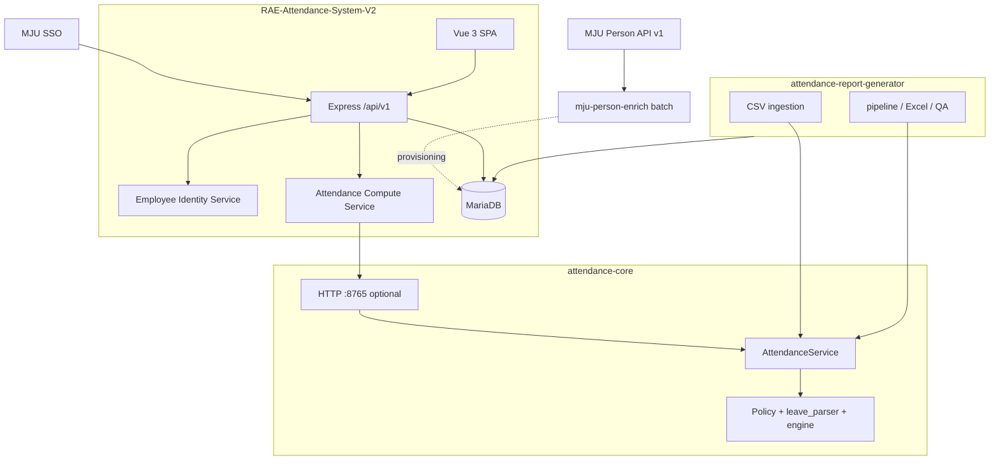

# Attendance Core Architecture

> **Canonical documentation** lives in this repository (`attendance-core/docs/`). Other repos link here; do not fork these files.

## Context

Three independent repositories participate without merging:

| Repository | Role |
|------------|------|
| `attendance-report-generator` | HP Premium CSV ingestion, batch/monthly reporting, Excel/QA |
| `attendance-core` | Shared domain rules (Python package + optional HTTP API) |
| `RAE-Attendance-System-V2` | SSO/auth, MariaDB, REST API, Vue UI |
| `mju-person-enrich` | Batch Person API enrichment (identity only) |

## Integration choice

| Consumer | Mechanism | Rationale |
|----------|-----------|-----------|
| `attendance-report-generator` | **Option A** — `pip install -e ../attendance-core` or Git tag | Same Python stack, in-process |
| `RAE-Attendance-System-V2` | **Option B** — HTTP to Attendance Core API | Node/Express runtime; no duplicated rules in JS |

## System diagram



## Boundaries

### Inside Attendance Core

- Dataclass models, policy loading from YAML-shaped dicts
- Day evaluation, period aggregation, leave classification
- Thai/Buddhist date parsing at the **input boundary** (ISO inside core logic)

### Outside Attendance Core

- Pandas DataFrame grouping (HP Premium column names) — `attendance-report-generator`
- Excel, openpyxl, monthly forms, QA baselines — reporting repo
- JWT, SSO, MariaDB persistence — RAE V2
- Person API token and citizen ID cache — `mju-person-enrich`

## Package layout

```text
attendance-core/
  attendance_core/
    models.py
    policy.py
    leave_parser.py
    engine.py
    service.py
    dates.py
    api/server.py
```

Reporting repo keeps thin shims under `src/engine/` and `src/parser/` re-exporting from `attendance_core`.
